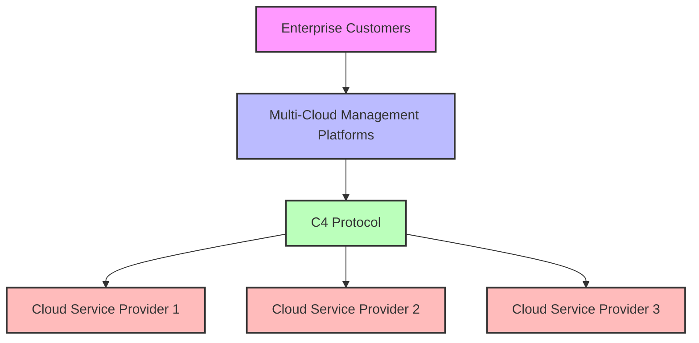
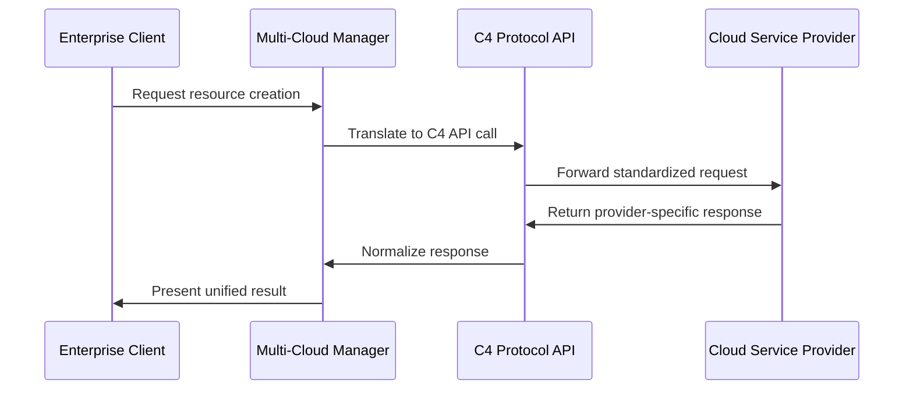
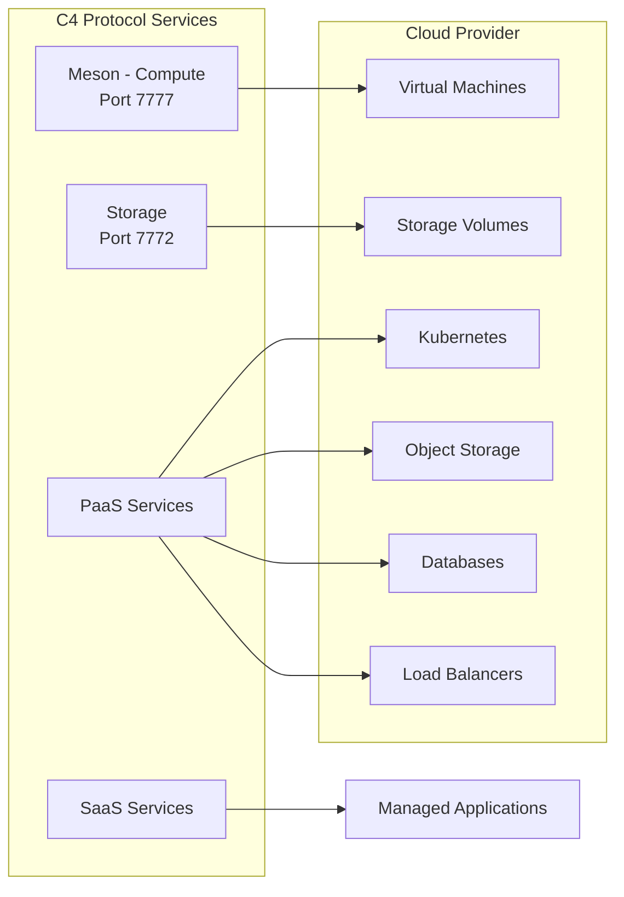

# C4 Protocol - Cloud Computing Common Connector

A standardized protocol for cloud service providers to integrate with enterprise-grade multi-cloud management platforms. Simplify your integration, expand your market reach.

## Overview

The C4 Protocol (Cloud Computing Common Connector) provides a universal API specification that enables cloud service providers to integrate with multi-cloud management platforms. This repository hosts the official API specifications and documentation website.

Are you a CSP? Come onboard!
Joining us is quite simple, here’s everything you need to know to join the Biggest Cloud resource marketplace.

Let’s start with some general details.
 

# C4, does it explode?
The Elemento C4 protocol is a standardized protocol that allows CSP to communicate with Dynamo’s environment which is used through Mesons to onboard new cloud providers from anywhere!

## Architecture

### C4 Protocol Positioning

### Communication Flow

### Service Architecture

## Strategic Value Proposition

- **Market Access**: Tap into a growing ecosystem of enterprise customers seeking multi-cloud solutions
- **Standardized Integration**: Simple API compliance process with clear documentation and support
- **Competitive Edge**: Join leading providers in offering seamless multi-cloud capabilities
- **Enterprise Ready**: Meet enterprise requirements for cloud service integration and management

## API Reference

### Meson (Compute) Endpoints

Endpoints for virtual machine management on the cloud provider. The matcher server listens on port 7777.

#### Status & Information
- `GET /api/v1.0/status` - Returns details in plain text format about the Meson provider
- `GET /api/v1.0/statusjson` - Returns details in JSON format about the Meson provider

#### VM Management
- `GET /api/v1.0/running` - List running instances with detailed status information
- `GET /api/v1.0/canallocate` - Check if a configuration can be allocated on the cloud provider
- `POST /api/v1.0/register` - Create new instances with specified configurations
- `DELETE /api/v1.0/unregister` - Remove instances and cleanup resources

### Storage Endpoints

Endpoints for disk/volume management on the cloud provider. The storage server listens on port 7772.

#### Volume Management
- `POST /api/v1.0/create` - Create a disk on the cloud provider
- `POST /api/v1.0/info` - Returns information about a disk by volume ID
- `POST /api/v1.0/accessible` - Returns all visible disks for a client
- `POST /api/v1.0/destroy` - Delete a disk on the cloud provider
- `GET /api/v1.0/cancreate` - Check if a volume configuration can be created

### PaaS Services

Platform as a Service endpoints for various cloud services. Each service follows a consistent pattern of endpoints.

#### S3 Object Storage
- `POST /api/v1.0/s3/create` - Create a new S3 bucket
- `GET /api/v1.0/s3/info` - Get information about an S3 bucket
- `GET /api/v1.0/s3/running` - List all S3 buckets
- `DELETE /api/v1.0/s3/delete` - Delete an S3 bucket

#### Kubernetes (KAAS)
- `POST /api/v1.0/kaas/create` - Create a new Kubernetes cluster
- `GET /api/v1.0/kaas/info` - Get information about a Kubernetes cluster
- `GET /api/v1.0/kaas/running` - List all Kubernetes clusters
- `DELETE /api/v1.0/kaas/delete` - Delete a Kubernetes cluster

#### Load Balancer
- `POST /api/v1.0/loadbalancer/create` - Create a new load balancer
- `GET /api/v1.0/loadbalancer/info` - Get information about a load balancer
- `GET /api/v1.0/loadbalancer/running` - List all load balancers
- `DELETE /api/v1.0/loadbalancer/delete` - Delete a load balancer

#### Elastic IP
- `POST /api/v1.0/elasticip/create` - Create a new elastic IP
- `GET /api/v1.0/elasticip/info` - Get information about an elastic IP
- `GET /api/v1.0/elasticip/running` - List all elastic IPs
- `DELETE /api/v1.0/elasticip/delete` - Delete an elastic IP

#### Database as a Service (DBaaS)
- `POST /api/v1.0/dbaas/create` - Create a new database instance
- `GET /api/v1.0/dbaas/info` - Get information about a database instance
- `GET /api/v1.0/dbaas/running` - List all database instances
- `DELETE /api/v1.0/dbaas/delete` - Delete a database instance

### SaaS Services

Software as a Service endpoints for managed applications.

#### Jupyter Notebook
- `POST /api/v1.0/jupyter/create` - Create a new Jupyter notebook instance
- `GET /api/v1.0/jupyter/info` - Get information about a Jupyter notebook instance
- `GET /api/v1.0/jupyter/running` - List all Jupyter notebook instances
- `DELETE /api/v1.0/jupyter/delete` - Delete a Jupyter notebook instance

## Common API Features

### Asynchronous Operations
Many endpoints support both synchronous and asynchronous operations via the `async` header:
- When set to `true`, the response includes a `poolingURL` to check operation status
- When set to `false`, the operation completes before responding

### Consistent Response Format
All API responses follow a consistent JSON structure with:
- Resource identifiers (UUIDs)
- Resource metadata
- Operation status
- Error information when applicable
